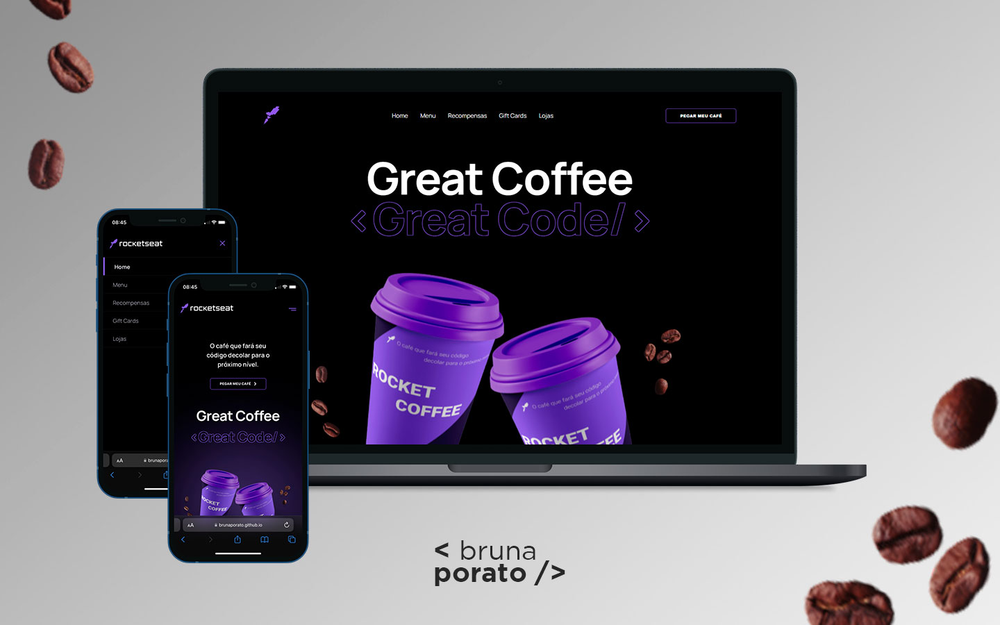

<strong><h1 align="center">RocketCoffee</h1></strong>

  

## 💻 Project
This is a responsive landing page for a coffee shop with a burger menu on its mobile version.

## 🚀 Tech

This project was developed using the following technologies:

- HTML
- CSS
- JavaScript

## 🎨 Layout

- Access the layout of the project on [Figma](https://www.figma.com/file/tNP0FgYVNYJlXtaCUxeqM8/DD-%2F-RocketCoffee-(Copy)?type=design&node-id=326-81&t=fhug4IYrD82xQEXy-0)

## 🌍 Deploy

- [Project online](https://brunaporato.github.io/rocketcoffee/  )
---
 

 Thank you for checking ♥ :wave:  
< brunaporato / >

